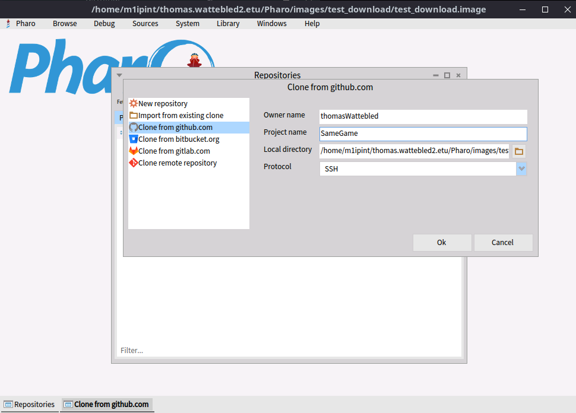

# SameGame
implementation du jeu SameGame par Wattebled Thomas, De Sainte Maresville Maxime, Javad .

# Installation du jeu 

Il Faut tout d'abord installer Bloc et Myg avec le code ci-dessous :

``` smalltalk 
Metacello new
    baseline: 'Bloc';
    repository: 'github://pharo-graphics/Bloc:05e5b0e385811719537f8cd89966b150a07be985/src';
    onConflictUseIncoming;
    load;
    lock.

Metacello new
    repository: 'github://Ducasse/Myg:v1.0.0';
    baseline: 'Myg';
    onConflictUseIncoming;
    load.
```

Il faut ensuite à partir de git repository browser remplir le Owner Name et le Project name

.

Pour jouer ensuite, il suffit de taper ```SameGame open ``` dans un playGround.

Pour trouver le code du jeu il suffit d'aller dans le package SameGame.
On peut retrouver les tests dans le package SameGame-Tests.

# Implementation

Nous avons décidé de creer une classe par couleur pour avoir la possibilité d'avoir des couleurs qui rapporte plus ou moins de point, des cases avec des bonus...

On y retrouve le design Pattern NullPattern qui permet de faire la diference entre kes cases clickable et les non clickables.

C'est la classe Board qui permet de reorganiser le jeu apres l'action du joueur.


